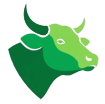
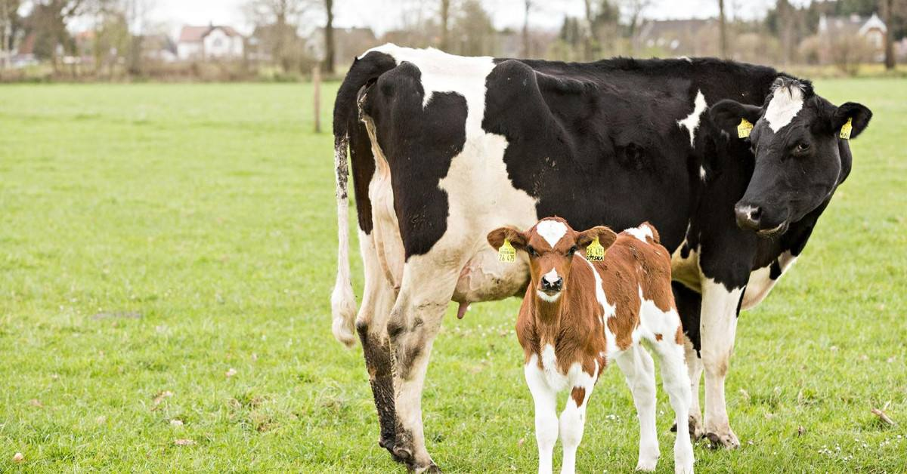
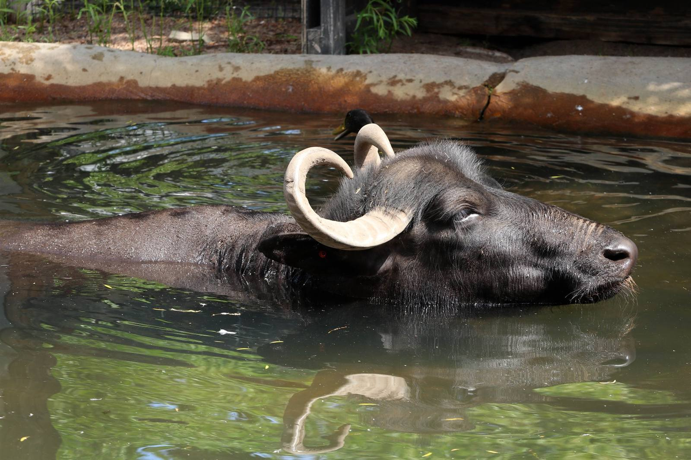
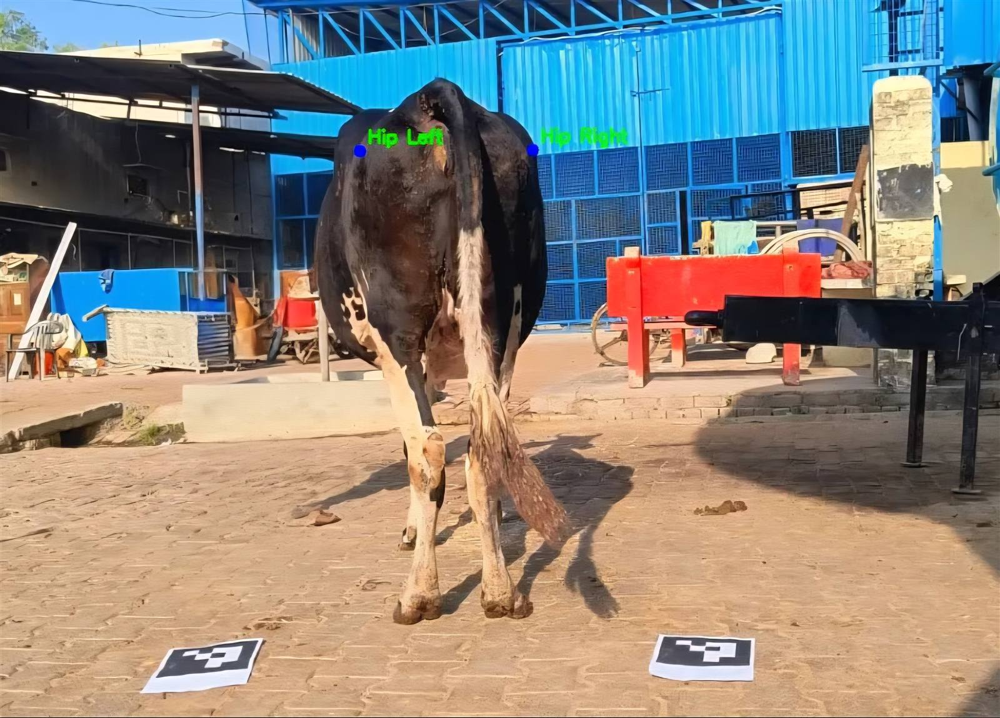
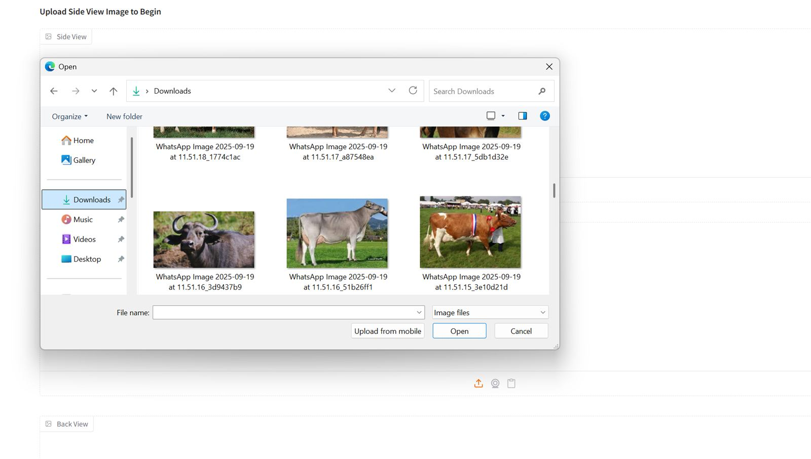
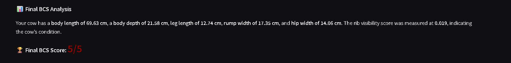
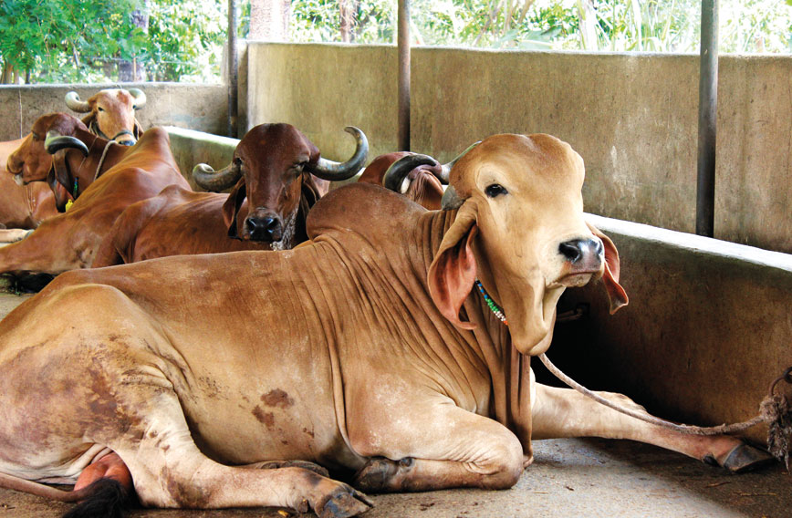
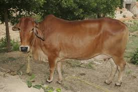
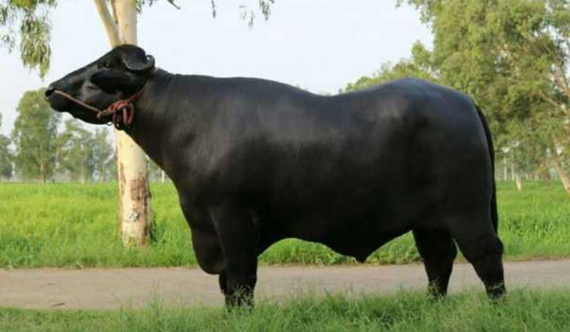

<div align="center">



# Gopalan AI

## Cattle Scoring &amp; Breed Selection

### Score your cattle, pick the right breed, and check its health — from a single photo. 📷✨

Smart, AI-powered livestock evaluation for Indian farmers.
Built to support the **Rashtriya Gokul Mission** 🇮🇳

<br/>

### 🔗 [**Live Website → gopalanai.netlify.app**](https://gopalanai.netlify.app/)

</div>

---

## 📖 Overview

**Gopalan AI** is a web platform for **Cattle Scoring &amp; Breed Selection** — helping farmers evaluate
their cattle and buffalo using nothing more than a smartphone photo. By placing a printed **ArUco marker**
next to the animal, the AI can measure it in real-world units, score its **body condition**,
identify its **breed**, and point the farmer to relevant **health guidance** — all in one place.

<div align="center">


</div>

---

## ❗ The Problem

Evaluating livestock the traditional way is **slow, manual, and inconsistent**:

- **Human error & bias** — body condition scoring depends on who is looking, so two people give two answers.
- **No standard tool** — farmers in rural areas rarely have access to trained classifiers or vets.
- **Hard to measure** — accurate body measurements normally need physical tools and expertise.
- **Missed health issues** — problems are often caught late, hurting the animal and the farmer's income.

For a national programme like the **Rashtriya Gokul Mission** — which depends on identifying elite
breeding stock and conserving indigenous breeds — inconsistent, subjective data is a real obstacle.

---

## 💡 Our Solution

Turn any smartphone into an objective evaluation tool using **computer vision + an ArUco marker for scale**.

<div align="center">

&nbsp;&nbsp;

</div>

- The **ArUco marker** is a printed black-and-white square of known size. Placed beside the animal, it
  lets the AI convert pixels into real centimetres — so measurements are accurate.
- The AI then **detects the animal**, **measures its body**, and produces a **standardized, objective
  body condition score** plus a **breed identification** — removing human bias.

---

## ⚙️ How It Works

<div align="center">

</div>

| Step | Action |
|:---:|---|
| **1** | 📷 **Take a photo** — a clear, side-on photo of your cow or buffalo in good light. |
| **2** | 🎯 **Add the ArUco marker** — place the printed marker beside the animal for real-world scale. |
| **3** | ⚡ **Upload & analyze** — the AI detects the animal and measures its body. |
| **4** | 📊 **Get your results** — breed, body measurements, and a clear body condition score. |

<div align="center">

</div>

---

## ✨ Features

- 🧠 **AI Body Condition Scoring** — objective, consistent scores from one photo.
- 📏 **Accurate Measurement** — ArUco-based real-world sizing (height, length, girth).
- 🐄 **Breed Guide** — detailed profiles of 8 cattle and 8 buffalo indigenous breeds.
- 🩺 **Health & Disease Support** — symptoms, causes, treatment, prevention, and emergency steps.
- 📸 **Photography Guide** — how to capture analysis-ready photos with an ArUco marker.
- ❓ **Help & FAQ** — plain-language answers for farmers.
- 📱 **Mobile-first & fast** — designed for real field conditions and low-end phones.

---

## 🌍 Impact

- **Standardization** — removes observer bias so every animal is scored the same way.
- **Accessibility** — puts expert-level evaluation in any farmer's hand, anywhere.
- **Better breeding** — reliable data helps identify strong breeding animals, supporting the
  Rashtriya Gokul Mission's genetic-improvement goals.
- **Healthier herds** — early health guidance means fewer preventable losses and stronger livelihoods.

---

## 🐮 Breeds Covered

**Cattle:** Gir · Sahiwal · Ongole · Hallikar · Rathi · Red Sindhi · Kankrej · Malnad Gidda
**Buffalo:** Murrah · Nili-Ravi · Surti · Jafarabadi · Mehsana · Bhadawari · Toda · Nagpuri

<div align="center">



</div>

---

## 🛠️ Tech Stack

- **[Vite](https://vitejs.dev/)** + **[React 18](https://react.dev/)** + **TypeScript**
- **[Tailwind CSS](https://tailwindcss.com/)** with **[shadcn/ui](https://ui.shadcn.com/)** components
- **[React Router](https://reactrouter.com/)** with route-level code splitting
- Scroll-reveal & count-up animations, fully responsive
- AI scoring served from a **Hugging Face Gradio** model, embedded in the Analyze page

---

## 🗺️ Pages

| Route | Page |
|---|---|
| `/` | Home — problem, solution, how it works, features |
| `/analyze` | Upload a photo and run the AI analysis |
| `/animal-guide` | Breed encyclopedia (clickable breed cards) |
| `/breeds/:slug` | Individual breed detail pages |
| `/medical-support` | Health checker — pick animal, find condition, get guidance |
| `/guide` | Step-by-step photography guide |
| `/help` | FAQ & help |
| `/about` | Mission, vision, values, and feedback form |

---

## 🚀 Getting Started

```bash
# Install dependencies
npm install

# Start the development server
npm run dev

# Build for production
npm run build

# Preview the production build
npm run preview
```

---

## 📁 Project Structure

```
src/
├── assets/          # Images and videos (breed photos, hero videos, logo)
│   └── animals/     # Cattle & buffalo photos, ArUco marker, measurement guides
├── components/      # Shared sections & UI (Navbar, Hero, Footer, HeroDecor, ...)
│   └── ui/          # Reusable primitives (button, card, tabs, ...)
├── data/            # Shared breed data
├── hooks/           # Shared React hooks
├── lib/             # Utilities
└── pages/           # Route pages (Home, Analyze, Animal Guide, Medical Support, ...)
```

---

## 🌐 Deployment

🚀 **Live at [gopalanai.netlify.app](https://gopalanai.netlify.app/)** — deployed on **Netlify**.

The project is set up for continuous deployment: it's connected to this GitHub repo, so **every push
to `main` triggers an automatic rebuild and redeploy** — no manual steps.

**Netlify configuration**

| Setting | Value |
|---|---|
| Build command | `npm run build` |
| Publish directory | `dist` |
| SPA redirects | handled by `netlify.toml` (all routes → `index.html`) |

**Deploy your own copy**

1. Fork/clone this repo.
2. On [Netlify](https://netlify.com), choose **Add new site → Import an existing project** and pick the repo.
3. Netlify auto-detects the settings above — click **Deploy**.

Any static host that serves `dist/` with an SPA fallback (Vercel, GitHub Pages, Cloudflare Pages, etc.) also works.

---

## 📄 License

Released under the **[MIT License](LICENSE)** — © 2026 Aryan Singh.

---

<div align="center">

**Made for the farmers of India** 🇮🇳

</div>
